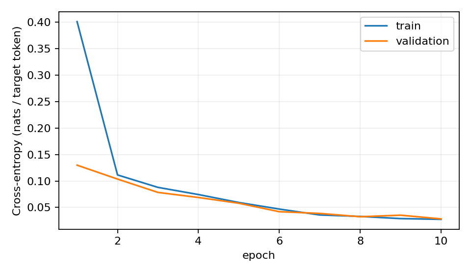
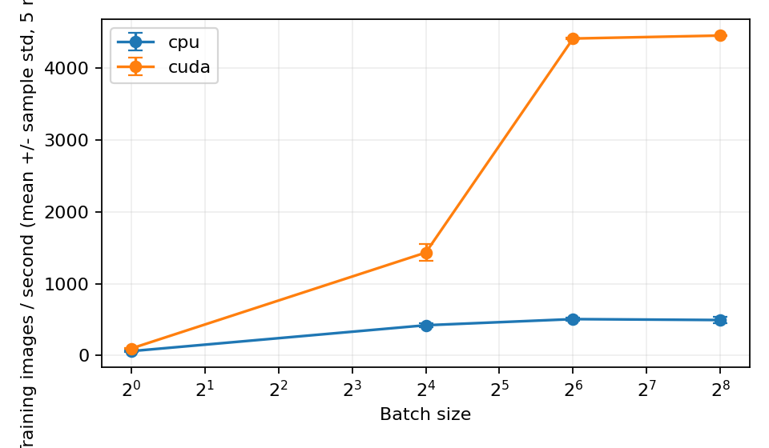

# Tiny VLM - RLS Entrance Challenge

| Expérience | Configuration | Métrique | Résultat | Interprétation |
|---|---|---|---|---|
| Modèle principal | configs/baseline.yaml | Exact-match test | **68,05 %**, n=1 seed | Nettement supérieur au modèle aveugle sur ce run |
| E1 aveugle | configs/blind.yaml | Taille / couleur / forme / relation, test | **33,28 / 20,10 / 15,30 / 0,00 %**, n=1 | Le texte seul ne permet pas de décrire l'image |
| E1 aveugle | configs/blind.yaml | Exact-match test | **1,70 %**, n=1 | Les mots libres sont presque toujours incorrects |
| E0 | configs/overfit.yaml | Loss / exact-match du batch | **0,000372 / 100 %** sur 16 exemples | Le pipeline peut mémoriser ; ce n'est pas un score test |
| S1 CPU | configs/benchmark.yaml, batch 64 | Débit d'entraînement | **507,68 ± 24,40 images/s**, 5 répétitions | CPU i5-10500H, 4 threads, tenseurs résidents |
| S1 GPU | configs/benchmark.yaml, batch 64 | Débit d'entraînement | **4 414,42 ± 9,09 images/s**, 5 répétitions | GTX 1650 ; environ 8,70 fois le débit CPU ici |
| Exploration heldout | configs/baseline.yaml | Exact-match test_heldout | **0,00 %**, n=1 | Échec de recombinaison couleur-forme |

**Niveau 1.** Une seed d'entraînement (42) par condition : écart-type entre seeds non estimable. Les ± de S1 sont des écarts-types échantillon entre répétitions de chronométrage, pas entre seeds. Matériel : NVIDIA GTX 1650 4 Go, Intel Core i5-10500H, Windows 11, Python 3.12.14, PyTorch 2.8.0+cu126. Les nombres ci-dessus viennent des JSON et CSV versionnés.

[Rapport PDF, 4 pages](report/report.pdf) · [Cours en français, 5 heures](docs/PARCOURS_5H.md) · [Questions du jury](docs/JURY.md) · [Usage de l'IA](AI_USAGE.md)

## Ce que fait le modèle

Image RGB 64×64 → CNN → grille 4×4 → 16 tokens visuels de dimension 128 → deux blocs Transformer → 27 scores par position → lettres jusqu'à eos ou 45 lettres.

521 307 paramètres, quatre têtes, attention écrite avec Linear, matmul, masque et softmax. Aucun modèle préentraîné ni module Transformer prêt à l'emploi. Les tokens visuels se voient entre eux ; les lettres ne voient que l'image et leur préfixe. La sortie du dernier token visuel prédit la première lettre.

Le modèle est volontairement plus petit que l'ordre de grandeur indicatif de 1-3 millions du brief. Il conserve tout le pipeline et rend les expériences rapides sur le matériel local. La grille 4×4 réduit le coût, avec une perte possible de détail.

## Installation

Depuis la racine du dépôt, avec Python 3.12 :

```powershell
python -m venv .venv
.venv\Scripts\Activate.ps1
python -m pip install torch==2.8.0 --index-url https://download.pytorch.org/whl/cu126
python -m pip install -r requirements.txt
```

Sur Linux/Colab, remplacer l'activation par `source .venv/bin/activate`, ou utiliser l'environnement Python du notebook. Le code reste dans src/ ; le notebook ne sert qu'à lancer les commandes. Sur CPU seulement, installer torch avec `--index-url https://download.pytorch.org/whl/cpu` et remplacer tous les `--device cuda` par `--device cpu`. Pour S1 CPU seul, utiliser `--devices cpu`.

requirements.txt fixe les dépendances directes. requirements-lock.txt enregistre toutes les versions du run Windows CUDA ; pour ce même environnement, l'installer avec `--extra-index-url https://download.pytorch.org/whl/cu126`. Le verrou CUDA n'est pas destiné à une machine sans CUDA.

## Reproduction complète

```powershell
python generate_data.py
python -m pytest -q
python -m src.inspect_batch
python -m src.train --config configs/overfit.yaml --device cuda
python -m src.train --config configs/baseline.yaml --device cuda
python -m src.train --config configs/blind.yaml --device cuda
python -m src.evaluate --checkpoint experiments/main/checkpoints/best.pt --split test --device cuda
python -m src.evaluate --checkpoint experiments/E1_blind/checkpoints/best.pt --split test --device cuda
python -m src.evaluate --checkpoint experiments/main/checkpoints/best.pt --split test_heldout --device cuda
python -m src.analyze_results --predictions experiments/main/results_test_predictions.json
python -m src.analyze_results --predictions experiments/main/results_test_heldout_predictions.json
python -m benchmarks.S1_throughput.benchmark --config configs/benchmark.yaml --devices cpu cuda
python report/build_report.py
```

Exécuter ces commandes dans l'ordre, sans entraînement concurrent pendant S1. Le générateur officiel reste inchangé : seed 42, train 20 000, val 2 000, test 2 000, heldout 2 000. Ne pas utiliser --debug pour les résultats.

Le meilleur checkpoint est choisi par la perte de validation. Chaque expérience enregistre sa configuration, son matériel, ses pertes, et ses checkpoints best.pt et last.pt. Les gros fichiers de données et checkpoints sont exclus de Git : un clone régénère les données et réentraîne le modèle. Les seeds et versions limitent la variabilité ; l'identité bit à bit entre matériels n'est pas garantie.

Pour reprendre à la fin d'une epoch :

```powershell
python -m src.train --config configs/baseline.yaml --device cuda --resume experiments/main/checkpoints/last.pt
```

La configuration doit rester identique, sauf augmentation du nombre d'epochs. Le checkpoint restaure le modèle, l'optimiseur et l'historique. L'ordre des batches est déterminé par seed + numéro d'epoch. Une interruption au milieu d'une epoch reprend depuis la dernière epoch sauvegardée.

## Démonstration

```powershell
python -m src.demo --checkpoint experiments/main/checkpoints/best.pt --split test --index 1 --device cpu --image tmp/example.png
```

L'exemple 1 du test est largeredtriangle ; notre checkpoint retourne largeredtriangle. Le script sauvegarde l'image agrandie et affiche les deux mots. Il fonctionne sur CPU avec le checkpoint entraîné sur GPU.

## Métriques détaillées

| Mesure | Modèle principal test | Aveugle test | Principal heldout |
|---|---:|---:|---:|
| Exact-match | 68,05 % | 1,70 % | 0,00 % |
| Taille | 84,80 % | 33,28 % | 80,14 % |
| Couleur | 74,83 % | 20,10 % | 75,80 % |
| Forme | 73,81 % | 15,30 % | 23,32 % |
| Relation | 44,22 % | 0,00 % | 44,63 % |
| Nombre d'objets | 99,90 % | 49,00 % | 97,60 % |
| Lettres, génération libre | 68,99 % | 16,17 % | 47,29 % |
| Lettres, préfixe vrai fourni | 98,52 % | 87,34 % | 89,73 % |

Attributs taille/couleur/forme : dénominateur de 3 020 objets sur test et 2 950 sur heldout. Relations : seulement les 1 020 scènes à deux objets sur test, 950 sur heldout. Les scores par emplacement sont aussi dans les JSON. Les attributs absents ou mal orthographiés comptent comme faux, sans correction automatique. Le nombre d'objets est évalué séparément.

L'exactitude des lettres en génération compare les positions et utilise la longueur maximale des deux mots au dénominateur. La mesure avec préfixe vrai exclut eos et padding ; **elle n'est pas une mesure de génération autonome**. Son niveau élevé pour le modèle aveugle montre le rôle des régularités orthographiques.

Le principal réussit 99,49 % des 980 scènes à un objet et 37,84 % des 1 020 scènes à deux objets. Parmi ses 639 erreurs strictes, 381 correspondent exactement aux mêmes attributs après inversion des deux objets et de la relation. Le générateur n'impose pas d'ordre canonique. L'exact-match officiel reste 68,05 % : cette analyse ne le remplace pas.

Le heldout échoue souvent sur la forme alors que taille et couleur restent reconnues. Exemple : largeyellowcross devient largeyellowcircle. Hypothèse issue de ces résultats : le modèle a appris des associations couleur-forme fréquentes. Une expérience supplémentaire serait nécessaire pour identifier la cause et améliorer cette recombinaison.

## Preuves et organisation

- src/ : tokenizer, données, CNN, attention, décodeur, entraînement, génération et métriques.
- configs/ : réglages versionnés ; aucune modification du code requise pour changer un hyperparamètre.
- tests/ : tests officiels conservés et tests d'alignement, padding, parser et génération ; **108 tests passés**.
- experiments/E0_overfit/ : mémorisation, courbe et prédictions du lot.
- experiments/main/ et experiments/E1_blind/ : loss.csv, loss.png, config.json, hardware.json, résultats et toutes les prédictions.
- benchmarks/S1_throughput/ : script, temps bruts, graphique et matériel.
- report/ : PDF et script qui le reconstruit à partir des mesures.
- docs/ : tutoriel en 1 h + 2 h + 2 h et exercices oraux.
- SOURCE.md et LICENSE : provenance et licence du template.

Les logs s'appellent précisément losses.csv. Les fichiers results_test.json et results_test_heldout.json indiquent le split pour éviter toute confusion. Le code ajouté n'a pas de commentaires ; les dimensions sont expliquées dans le cours et affichées par inspect_batch. Les commentaires du générateur et des tests officiels sont conservés.




S1 utilise des tenseurs synthétiques déjà sur le périphérique, 16 tokens visuels + 45 lettres, cinq pas de chauffe puis cinq répétitions de dix pas. Chargement et transferts sont exclus ; forward, loss, backward, clipping et AdamW sont inclus. Synchronisation CUDA avant et après le timer. Pour les quatre batches mesurés, le GPU reste plus rapide ; aucun croisement CPU/GPU n'a été observé dans ce protocole. L'avantage est plus faible à batch 1.

## Limites et transparence

Une seed par condition, aucune étude de niveau 2 revendiquée. Pas de balayage d'hyperparamètres, de profiling détaillé, d'AMP ou de cache KV. Aucun résultat Colab n'est revendiqué. Les limites du parser, l'ordre des objets et les scènes synthétiques restreignent l'interprétation. Les résultats ont été produits avec l'assistance déclarée dans AI_USAGE.md ; la maîtrise personnelle doit être vérifiée par les exercices, pas présumée.

Le journal experiments/DEV_LOG.md conserve les problèmes rencontrés. Les commits reflètent le travail réellement effectué aujourd'hui ; aucun historique de dix jours n'est simulé. L'envoi au jury et le checkpoint de calendrier restent à gérer selon la date réelle du challenge.

## Sources utilisées

- [Template officiel RLS](https://github.com/RLS-ResearchLab/RLS-Entrance-Challenge), version et empreinte dans SOURCE.md.
- [Attention Is All You Need](https://arxiv.org/abs/1706.03762), formule d'attention et architecture Transformer.
- [Référence d'attention PyTorch 2.8](https://docs.pytorch.org/docs/2.8/generated/torch.nn.functional.scaled_dot_product_attention.html), convention du masque et contrôle numérique.
- [CrossEntropyLoss PyTorch 2.8](https://docs.pytorch.org/docs/2.8/generated/torch.nn.CrossEntropyLoss.html), logits et ignore_index.
